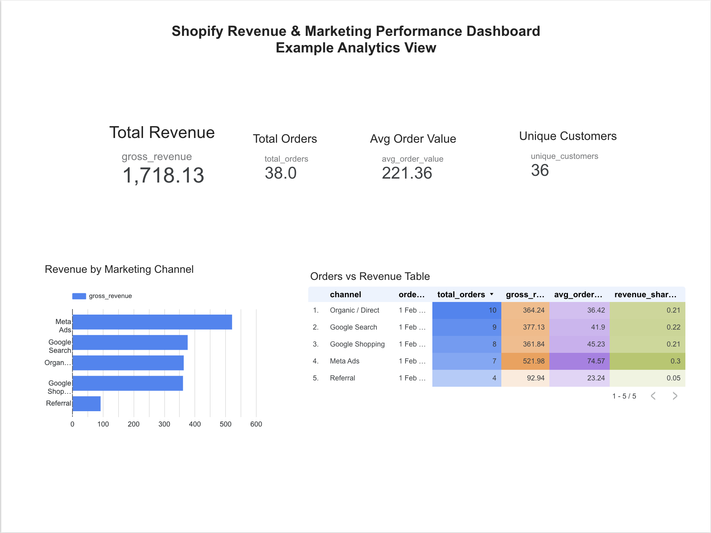

# 📊 Ecommerce Analytics Pipeline (Shopify → BigQuery → dbt → Looker)

End-to-end analytics system that transforms raw Shopify data into business-ready insights on revenue, customer LTV, and marketing performance.

Built using a modern data stack with automated daily pipelines and dashboard reporting.

---

## ⚡ Key Highlights

- End-to-end pipeline: Shopify → Airbyte → BigQuery → dbt → Looker
- Built analytics-ready data models (revenue, LTV, marketing performance)
- Automated daily data pipeline (no manual reporting)
- Designed for real-world ecommerce use cases

## What This Does

Takes a Shopify store from this:

> "We have Shopify reports and Google Ads reports but they don't match and we don't know which campaigns are actually profitable."

To this:

> A live dashboard showing revenue, gross margin, marketing performance by channel, and customer LTV — updated automatically every morning.

---

## Stack

| Layer | Tool | Cost |
|---|---|---|
| Source | Shopify API | free (included in store) |
| Ingestion | Airbyte Cloud | free tier |
| Warehouse | BigQuery (GCP) | free tier |
| Transformation | dbt Cloud | free Developer tier |
| Visualization | Looker Studio | free |
| **Total** | | **~€0/mo for demo** |

For real client projects: ~€150–250/mo depending on data volume.

---

## Repository Structure

```
ecom-demo/
├── README.md                        ← you are here
├── CHECKLIST_v1.md                  ← step-by-step build guide with gotchas
├── dbt/
│   ├── dbt_project.yml              ← dbt project config
│   ├── models/
│   │   ├── sources.yml              ← declares raw BigQuery tables
│   │   ├── staging/
│   │   │   ├── stg_orders.sql       ← cleans raw Shopify orders
│   │   │   ├── stg_order_lines.sql  ← unnests line items from JSON
│   │   │   └── stg_customers.sql    ← cleans customer data
│   │   └── marts/
│   │       ├── mart_revenue_monthly.sql        ← monthly revenue & AOV
│   │       ├── mart_marketing_performance.sql  ← channel attribution & ROAS
│   │       └── mart_customer_ltv.sql           ← customer LTV & segments
│   └── seeds/
│       └── product_margins.csv      ← COGS data (manual or from Lexoffice)
└── docs/
    └── architecture.md              ← pipeline diagram and decisions
```

---

## Pipeline Architecture

```
Shopify Dev Store / Client Store
          │
          │  Admin API (orders, customers, products)
          ▼
  Airbyte Cloud (free tier)
          │
          │  daily sync
          ▼
  BigQuery — ecom_raw
  ├── orders          (line_items nested as JSON array)
  ├── customers
  ├── products
  └── order_refunds
          │
          │  dbt Cloud — daily job 06:00 UTC
          ▼
  BigQuery — ecom_marts
  ├── stg_orders           (view — cleaned orders)
  ├── stg_order_lines      (view — unnested line items)
  ├── stg_customers        (view — cleaned customers)
  ├── mart_revenue_monthly         (table — revenue KPIs)
  ├── mart_marketing_performance   (table — channel attribution)
  └── mart_customer_ltv            (table — customer segments)
          │
          │  direct BigQuery connection
          ▼
  Looker Studio
  ├── Page 1: Revenue & Margin
  ├── Page 2: Customer LTV & Cohorts
  └── Page 3: Marketing Performance
```

---

## The Three Dashboards

### 1. Revenue & Margin
Answers: *Are we growing? What is our real margin?*
- Monthly revenue and gross profit trend
- Average order value over time
- Total orders and unique customers

### 2. Customer LTV & Cohorts
Answers: *Who are our best customers? Are they coming back?*
- LTV segmentation: High / Mid / Low value customers
- Repeat purchase rate
- Top customers by revenue
- Acquisition channel vs LTV

### 3. Marketing Performance
Answers: *Which channels are actually profitable after product costs?*
- Revenue by channel
- Revenue share per channel
- Orders and AOV by channel
- The number that matters: gross profit per channel (not just revenue)

## 📊 Dashboard

The final output is a business-facing dashboard tracking:

- Revenue and gross profit trends  
- Customer lifetime value (LTV)  
- Repeat purchase behavior  
- Marketing performance by channel  



---

## dbt Models

### Staging Layer (views)
| Model | Source | Purpose |
|---|---|---|
| `stg_orders` | `ecom_raw.orders` | Cleans orders, extracts customer JSON, adds `is_completed` flag |
| `stg_order_lines` | `ecom_raw.orders` | Unnests `line_items` JSON array → one row per product |
| `stg_customers` | `ecom_raw.customers` | Cleans customers, parses tags (VIP, referral), extracts address JSON |

### Marts Layer (tables)
| Model | Purpose | Key Metrics |
|---|---|---|
| `mart_revenue_monthly` | Monthly revenue rollup | gross_revenue, net_revenue, avg_order_value, unique_customers |
| `mart_marketing_performance` | Channel attribution | orders by channel, revenue by channel, revenue_share_pct |
| `mart_customer_ltv` | Customer segments | total_revenue, ltv_tier, is_repeat_buyer, top_vendor |

---

## Key Technical Decisions

**Why Airbyte Cloud over Airbyte OSS?**  
Zero server maintenance. Same connectors. Free tier covers SME data volumes.
OSS only makes sense if a client has strict data residency requirements.

**Why dbt Cloud over dbt Core?**  
Scheduling, logging, and docs hosting without managing infrastructure.
The free Developer tier covers solo operator needs.

**Why Looker Studio over Metabase?**  
Free, native BigQuery integration, clients already have Google accounts.
Metabase is better for more complex embedding needs — consider it for larger clients.

**Why no Airflow?**  
dbt Cloud's built-in scheduler handles everything needed here.
Airflow adds operational complexity with no benefit at this scale.

**Dev vs Production datasets:**
- `ecom_dev_marts` — written when running models manually in dbt Cloud IDE
- `ecom_marts` — written by the scheduled production job
- Looker Studio always points to `ecom_marts`

---

## Setup

See **`CHECKLIST_v1.md`** for the full step-by-step guide including all gotchas discovered during the first build.

Quick summary:
1. Create GCP project + BigQuery datasets (region: EU)
2. Create Shopify custom app → get Admin API token
3. Configure Airbyte Cloud: Shopify → BigQuery
4. Configure dbt Cloud: connect GitHub + BigQuery, set region to EU
5. Run `dbt run` — all 6 models should go green
6. Create production job in dbt Cloud
7. Connect Looker Studio to `ecom_marts`

---

## Changelog

| Version | Date | Notes |
|---|---|---|
| v1.0 | March 2026 | First complete build — demo stack with Egnition sample data |

---

## Author

Built by Javad — data engineering consultant, Berlin.  
Specializing in e-commerce analytics for German SMEs.